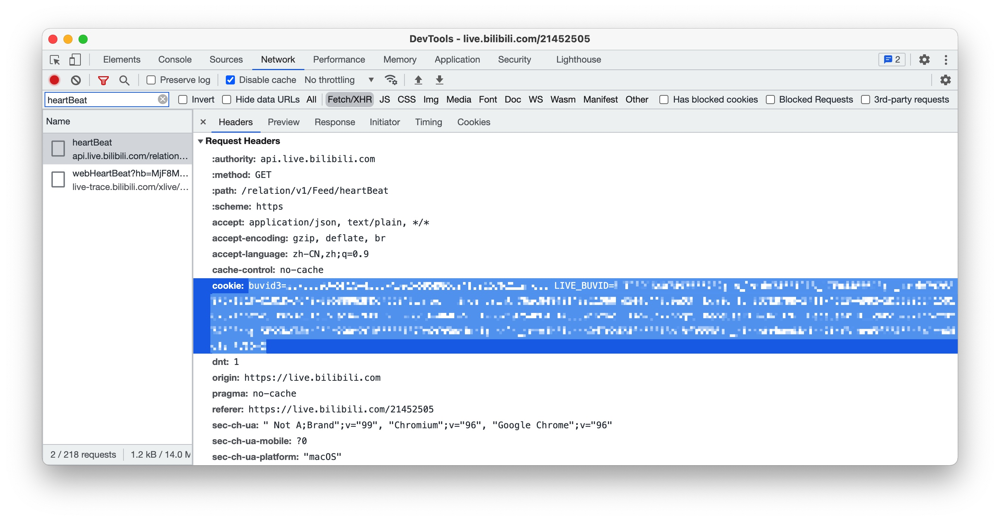

# Bilibili Live Helper

Bilibili直播相关自动化脚本

## 功能

### 主站

- [x] 每日登录
- [x] 每日观看视频
- [x] 每日分享视频（并不会实际分享）

### 直播区

- [x] 每日签到
- [x] 应援团签到
- [x] 粉丝勋章弹幕打卡
- [x] 自动赠送背包礼物
- [x] 自动点赞直播间3次
- [x] 自动分享直播间5次
- [x] 自动观看直播间30分钟

## 配置方法

1. 运行环境

需要环境 Node.js >= 14.18.2

2. 配置

```bash
cp .env.example .env
vi .env
```

根据注释修改，如果需要禁用某项功能，将等号后置空或者改为0。

3. 获取Cookies

程序会尝试从以下途径获取Cookies：`.env`中的`COOKIES`、`.cookies`文件内容、环境变量`COOKIES`。

打开无痕模式，随便打开一个直播间，然后打开开发人员工具，在网络/Network选项卡内找到`heartBeat`或`webHeartBeat`请求，在请求头中找到Cookie，复制冒号后面的内容（即下图浅蓝色部分）。



请确认Cookies里存在`bili_jct=`和`LIVE_BUVID=`。

4. 开始运行

```bash
npm install
npm run build
node dist/app.js
```

## 许可

MIT License
